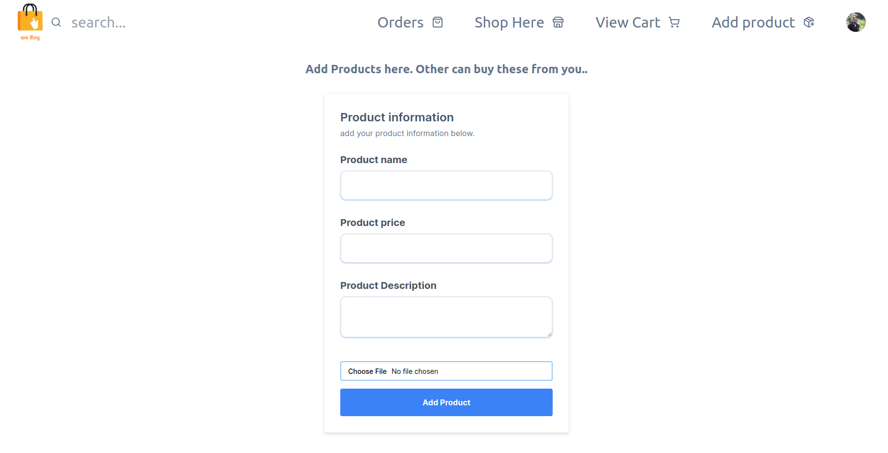
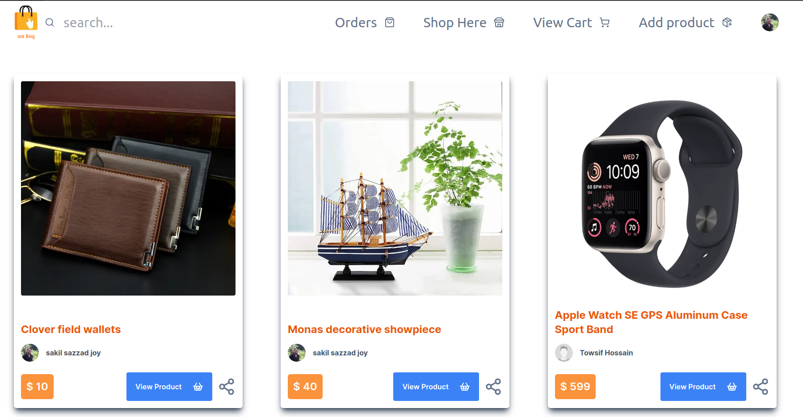
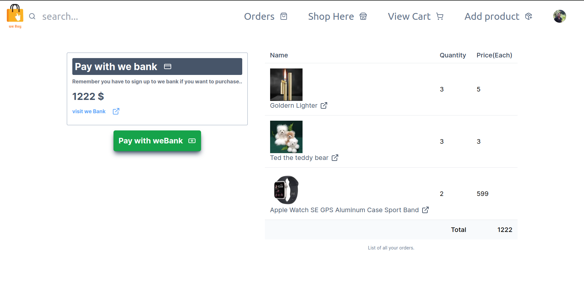
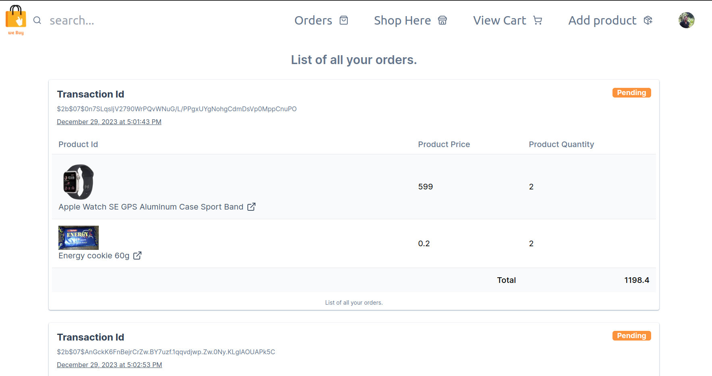
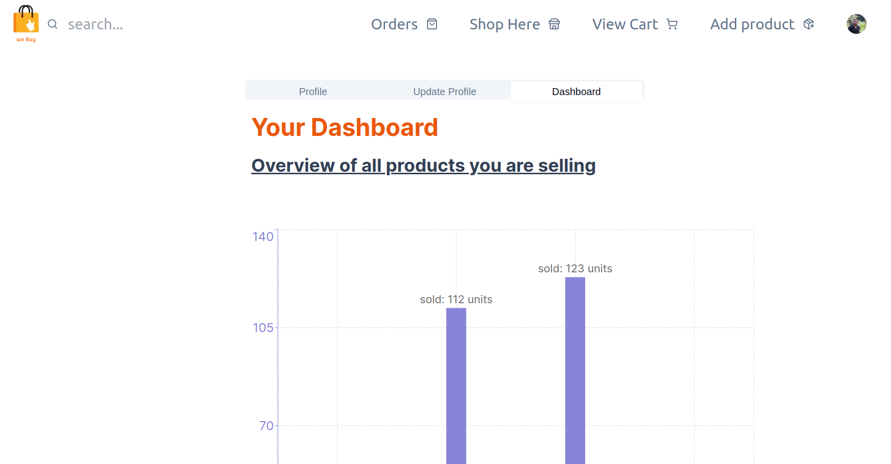

# **we Buy**

An ecommerce web application

---

## Live preview

### [weBuy(Live)](https://we-buy-omega.vercel.app/)

### [we Bank(Live)](https://we-bank.vercel.app/)

---

## **Description and goals**

An ecommerce website that fascillitates transactions between two different organizations.

- A Bank organization(we Bank)
  - [link to we-bank](https://github.com/ss-joy/we-bank)
- An ecommerce website(we Buy)

The main objective of this project is to demonstrate transactions and communications between different api endpoints.This project gives users the ability to order and buy various kinds of items from an ecommerce shop. In order to complete the purchase they need to sign up to a different entity. A fictional bank called **weBank**.

---

## Features

- Fully typesafe frontend and backend code written in Typescript.
- Complete **runtime data validation** implemented with zod both in client and server side.
- Fully implemented Authentication and Authorization.
- Fully responsive in all screen sizes and devices.

---

## Basic workflow


---

## Technologies used

- <mark>Typescript</mark> : Typesafe code implementation
- <mark>NextJs</mark> :Frontend and Backend integration
- <mark>MongoDb</mark> :Database
- <mark>Mongoose</mark> : Database ODM
- <mark>Tailwind CSS</mark> : Styling
- <mark>Radix UI</mark> : Icons,Accessible components
- <mark>Next Auth</mark> : Authentication and Authorization
- <mark>Firebase</mark> : File storage

## Some screenshots

- Homepage:

  

- Add Product page
  
- Shopping Page

  

- Cart Page
  

- Orders Page
  

- Dashboard Page
  

## Setup:

- First clone this github repo.
- Then clone the [we-bank](https://github.com/ss-joy/we-bank) github repo. They depend on each other. Follow the instructions for we bank using the link above.
- Install all the dependencies using npm.
  - `npm i` or `pnpm i`
- Run the command `npm run dev` or `pnpm dev`
- This should start the ecom application at http://localhost:3000
- Then you should create a firebase app for file storage. Get all the api information.
- Add a .env.local file inside the **ecommerce** folder and
  add these environment variables.
  ```
  MONGODB_URI=
  NEXT_PUBLIC_FIREBASE_STORAGE_BUCKET=
  NEXTAUTH_SECRET=
  FIREBASE_API_KEY=
  FIREBASE_AUTH_DOMAIN=
  FIREBASE_PROJECT_ID=
  FIREBASE_MESSAGINGSENDER_ID=
  FIREBASE_APP_ID=
  ```
